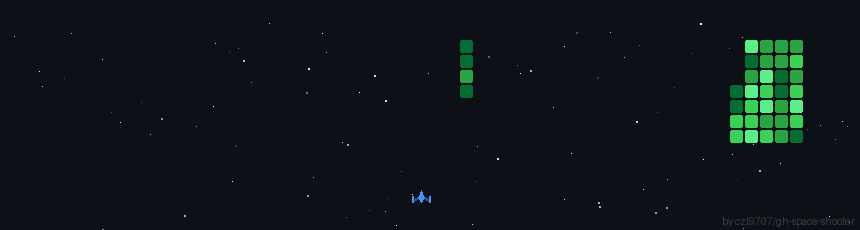

# 💫 About Me:
# 👋 Hi, I'm Krish Sharma

🎓 **BCA Student** | ☁️ **Aspiring Cloud Computing Engineer**

I’m a BCA student passionate about **cloud computing** and modern application deployment. I enjoy learning how scalable, secure, and efficient systems are built on the cloud and turning theoretical knowledge into real-world solutions.

---

## ☁️ About Me

- 🎓 BCA student with a strong foundation in programming and computer fundamentals  
- ☁️ Interested in cloud platforms, virtualization, and deployment models  
- ⚙️ Focused on building cloud-ready applications  
- 🚀 Continuously improving technical and problem-solving skills  

---

## 🛠️ Tech Stack & Skills

### 💻 Programming
- Python  
- Java  
- C++  

### ☁️ Cloud Computing
- Cloud Fundamentals (IaaS, PaaS, SaaS)  
- Virtualization & Deployment Models  
- Basics of AWS / Azure / GCP  

### 🌐 Web Development
- HTML  
- CSS  
- JavaScript  
- React  

### 🗄️ Databases
- MySQL  
- DBMS Fundamentals  

### ⚙️ Systems & Tools
- Linux Basics  
- Operating Systems Concepts  
- Networking Fundamentals  

---

## 🎯 Currently Learning

- Cloud platforms & services (AWS / Azure / GCP)  
- Virtual Machines & Containers  
- Cloud security & scalability basics  
- Deploying web and Python applications on the cloud  

---

## 🤝 Open to Collaboration

I’m open to collaborating on:
- Cloud-based web applications  
- Beginner-friendly cloud & DevOps projects  
- Python / Java applications deployed on cloud platforms  

---

## 💬 Ask Me About

- Cloud computing fundamentals  
- Python & Java programming  
- Web development (HTML, CSS, JavaScript, React)  
- DBMS & Linux basics  

---

## ⚡ Fun Fact

I enjoy learning how applications move from **local systems to the cloud** — from writing code to deploying it and making it accessible worldwide 🌍

---

⭐ *Feel free to explore my repositories and connect with me!*

  

## 🌐 Socials:
   

# 💻 Tech Stack:
                                   
# 📊 GitHub Stats:
 
 

  ## 💰 You can help me by Donating
   

  
<!-- Proudly created with GPRM ( https://gprm.itsvg.in ) -->
