<div align="center">

<!-- ANIMATED TYPING HERO -->


</div>

<div align="center">

[](https://git.io/typing-svg)

</div>

<div align="center">


[](https://github.com/COZYkrish)
[](https://github.com/COZYkrish)

</div>

<div align="center">

```
╔══════════════════════════════════════════════════════════════════╗
║  "The future belongs to those who engineer it — line by line."   ║
╚══════════════════════════════════════════════════════════════════╝
```

</div>


---

## ◈ SYSTEM IDENTITY

<table>
<tr>
<td width="55%">

### 👾 `> INIT_PROFILE.exe`

```yaml
name: "Krish Sharma"
alias: "COZYkrish"
role: "Full Stack Engineer & Cloud Architect"
university: "Centurion University of Technology"
degree: "Bachelor of Computer Applications"
location: "India 🇮🇳"
status: "Building the future, one commit at a time"

focus_areas:
  - "Full Stack Web Engineering"
  - "Cloud Computing & Architecture"
  - "AI-Powered Applications"
  - "Dashboard & Analytics Systems"
  - "Immersive UI/UX Systems"

currently_learning:
  - "AWS / Azure / GCP Architecture"
  - "Microservices & Containers"
  - "LLM Integration Patterns"
  - "Advanced System Design"
```

</td>
<td width="45%" align="center">


<br>


</td>
</tr>
</table>

---

## ◈ ORIGIN STORY

<div align="center">

> *"I didn't start with a computer science degree — I started with curiosity."*

</div>

It began with a simple question: *"How does a website actually work?"*

That question opened a rabbit hole that never closed. From writing my first `Hello World` in Python to designing multi-layered full-stack systems with real-time analytics, authentication flows, and cloud deployment pipelines — every line of code has been a step deeper into an obsession.

As a **BCA student at Centurion University**, I've been on a mission to go beyond the curriculum. While others study theory, I build systems. I've shipped **10+ full-stack projects** spanning fintech dashboards, AI desktop assistants, enterprise complaint platforms, and fitness analytics engines — each one a piece of a larger engineering identity.

My passion lives at the intersection of **engineering depth** and **design beauty** — where scalable backend architecture meets immersive, futuristic user interfaces. I believe software should not just *work* — it should feel *alive*.

Currently, I'm going deep on **cloud computing** and **AI integration**, learning how to architect systems that aren't just functional today, but scalable for what comes next.

**I don't just write code. I engineer experiences.**


---

## ◈ TECH ARSENAL

### 🎨 Frontend Engineering


### ⚙️ Backend Engineering


### 🗄️ Databases & Storage


### ☁️ Cloud & Infrastructure


### 🤖 AI / ML & Data Analytics


### 🛠️ Tools & DevOps


---

## ◈ SKILL ARCHITECTURE

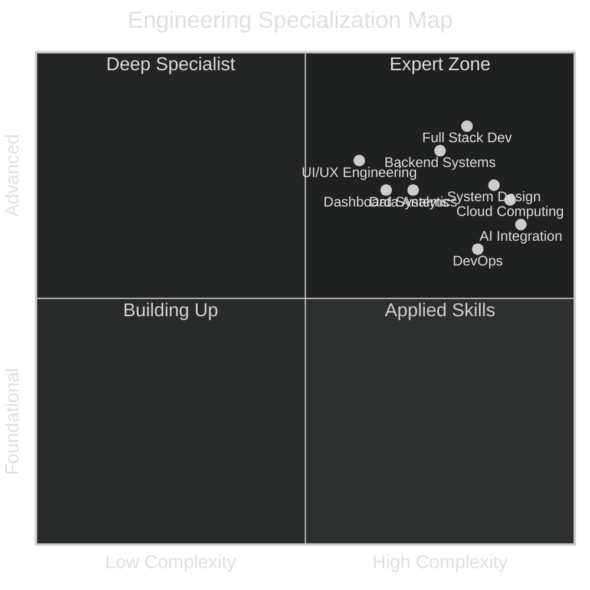
```mermaid
%%{init: {'theme': 'dark'}}%%
quadrantChart
    title Engineering Specialization Map
    x-axis Low Complexity --> High Complexity
    y-axis Foundational --> Advanced
    quadrant-1 Expert Zone
    quadrant-2 Deep Specialist
    quadrant-3 Building Up
    quadrant-4 Applied Skills
    Full Stack Dev: [0.80, 0.85]
    Backend Systems: [0.75, 0.80]
    UI/UX Engineering: [0.60, 0.78]
    Dashboard Systems: [0.65, 0.72]
    System Design: [0.85, 0.73]
    Cloud Computing: [0.88, 0.70]
    Data Analytics: [0.70, 0.72]
    AI Integration: [0.90, 0.65]
    DevOps: [0.82, 0.60]
```

**Skill Proficiency:**

| Skill | Proficiency |
|---|---|
| Full Stack Development | `████████████████░░░░` 85% |
| Backend Engineering | `███████████████░░░░░` 80% |
| UI/UX Engineering | `████████████████░░░░` 78% |
| System Design | `██████████████░░░░░░` 73% |
| Data Analytics | `██████████████░░░░░░` 72% |
| Cloud Computing | `██████████████░░░░░░` 70% |
| AI Integration | `█████████████░░░░░░░` 65% |
| DevOps | `████████████░░░░░░░░` 60% |

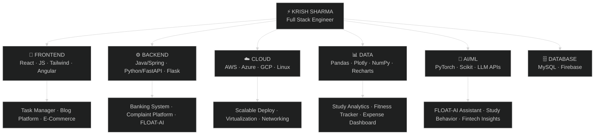
```mermaid
%%{init: {'theme': 'dark'}}%%
graph TB
    KRISH["⚡ KRISH SHARMA<br/>Full Stack Engineer"]

    KRISH --> FE["🎨 FRONTEND<br/>React · JS · Tailwind · Angular"]
    KRISH --> BE["⚙️ BACKEND<br/>Java/Spring · Python/FastAPI · Flask"]
    KRISH --> CLOUD["☁️ CLOUD<br/>AWS · Azure · GCP · Linux"]
    KRISH --> DATA["📊 DATA<br/>Pandas · Plotly · NumPy · Recharts"]
    KRISH --> AI["🤖 AI/ML<br/>PyTorch · Scikit · LLM APIs"]
    KRISH --> DB["🗄️ DATABASE<br/>MySQL · Firebase"]

    FE --> PROJ1["Task Manager · Blog Platform · E-Commerce"]
    BE --> PROJ2["Banking System · Complaint Platform · FLOAT-AI"]
    CLOUD --> PROJ3["Scalable Deploy · Virtualization · Networking"]
    DATA --> PROJ4["Study Analytics · Fitness Tracker · Expense Dashboard"]
    AI --> PROJ5["FLOAT-AI Assistant · Study Behavior · Fintech Insights"]
```


---

## ◈ PROJECT COMMAND CENTER

> **10 Production-Grade Projects** — Each one a chapter in an engineering story.

---

### 〔01〕 TASK MANAGEMENT SYSTEM

> *Productivity, engineered with precision.*

A modern task lifecycle platform built to manage workflows, track productivity, and organize projects with clean architecture and an intuitive interface.

**✦ Core Features**
- Full CRUD task operations with priority levels
- Status-driven workflow: `TODO → IN_PROGRESS → REVIEW → DONE`
- User authentication & session management
- Dashboard with productivity insights

**✦ Tech Stack:** `React` `Spring Boot` `MySQL` `Tailwind CSS`

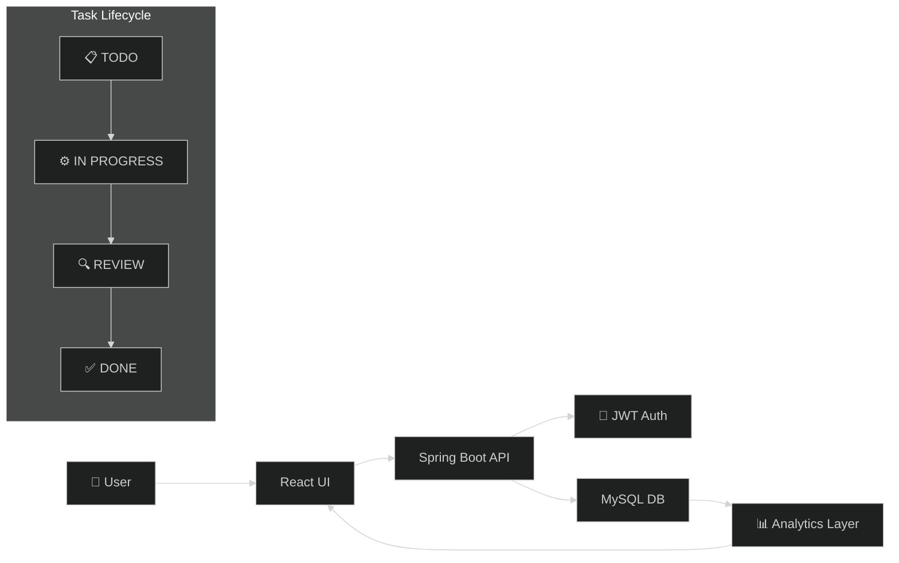
```mermaid
%%{init: {'theme': 'dark'}}%%
flowchart LR
    U["👤 User"] --> UI["React UI"]
    UI --> API["Spring Boot API"]
    API --> AUTH["🔐 JWT Auth"]
    API --> DB["MySQL DB"]
    DB --> ANALYTICS["📊 Analytics Layer"]
    ANALYTICS --> UI

    subgraph "Task Lifecycle"
        T1["📋 TODO"] --> T2["⚙️ IN PROGRESS"]
        T2 --> T3["🔍 REVIEW"]
        T3 --> T4["✅ DONE"]
    end
```

[](https://github.com/COZYkrish)

---

### 〔02〕 BLOG PLATFORM

> *Where ideas become digital experiences.*

A dynamic content publishing platform with full CMS capabilities, supporting Markdown rendering, category management, and responsive reading experiences.

**✦ Core Features**
- Content creation & management interface
- Dynamic article rendering with Markdown support
- Category, tag, and author management
- Comment system & social sharing

**✦ Tech Stack:** `React` `Django/Flask` `MySQL` `CSS3`

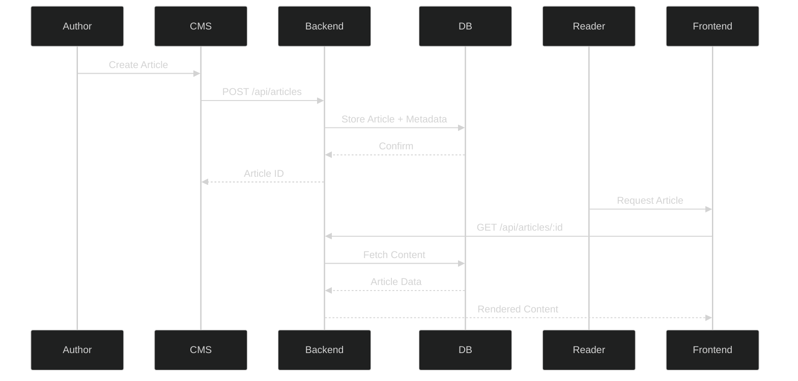
```mermaid
%%{init: {'theme': 'dark'}}%%
sequenceDiagram
    Author->>CMS: Create Article
    CMS->>Backend: POST /api/articles
    Backend->>DB: Store Article + Metadata
    DB-->>Backend: Confirm
    Backend-->>CMS: Article ID
    Reader->>Frontend: Request Article
    Frontend->>Backend: GET /api/articles/:id
    Backend->>DB: Fetch Content
    DB-->>Backend: Article Data
    Backend-->>Frontend: Rendered Content
```

[](https://github.com/COZYkrish)

---

### 〔03〕 E-COMMERCE WEB APPLICATION

> *The complete online shopping engine.*

A full-featured e-commerce platform with product catalog, cart engine, checkout workflows, and admin inventory management — built for scale.

**✦ Core Features**
- Product catalog with search, filter, sorting
- Cart & wishlist system
- Secure checkout workflow
- Admin dashboard: inventory, orders, analytics
- User auth + order history

**✦ Tech Stack:** `React` `Spring Boot` `MySQL` `Tailwind CSS`

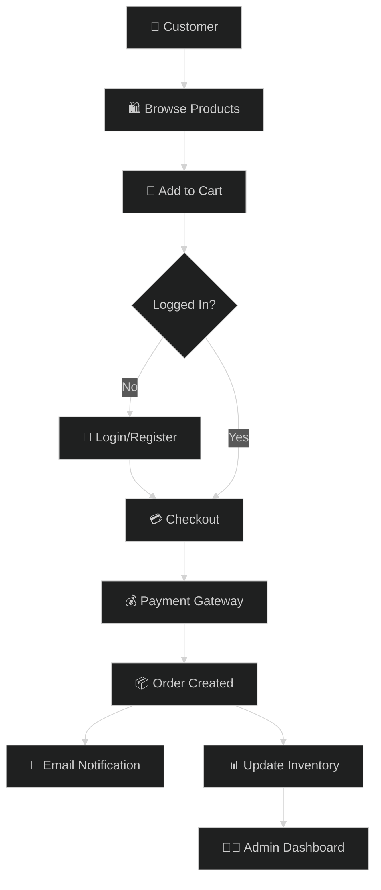
```mermaid
%%{init: {'theme': 'dark'}}%%
flowchart TD
    USER["👤 Customer"] --> BROWSE["🛍️ Browse Products"]
    BROWSE --> CART["🛒 Add to Cart"]
    CART --> AUTH{"Logged In?"}
    AUTH -- No --> LOGIN["🔐 Login/Register"]
    LOGIN --> CHECKOUT
    AUTH -- Yes --> CHECKOUT["💳 Checkout"]
    CHECKOUT --> PAYMENT["💰 Payment Gateway"]
    PAYMENT --> ORDER["📦 Order Created"]
    ORDER --> NOTIFY["📧 Email Notification"]
    ORDER --> INVENTORY["📊 Update Inventory"]
    INVENTORY --> ADMIN["👨‍💼 Admin Dashboard"]
```

[](https://github.com/COZYkrish)

---

### 〔04〕 FLOAT-AI — THE VOICE OF YOUR DESKTOP

> *The future of human-computer interaction.*

An AI-powered desktop assistant with voice recognition, natural language processing, and intelligent response capabilities — designed for immersive, hands-free computer control.

**✦ Core Features**
- Real-time voice input & speech recognition
- NLP-powered intent classification
- System control commands (open apps, search, etc.)
- Conversational memory & context retention
- Futuristic HUD interface

**✦ Tech Stack:** `Python` `LLM APIs` `Speech Recognition` `FastAPI` `Electron/Tkinter`

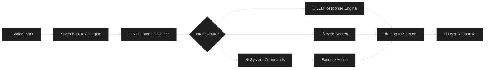
```mermaid
%%{init: {'theme': 'dark'}}%%
flowchart LR
    VOICE["🎤 Voice Input"] --> STT["Speech-to-Text Engine"]
    STT --> NLP["🧠 NLP Intent Classifier"]
    NLP --> ROUTER{"Intent Router"}
    ROUTER --> SYS["⚙️ System Commands"]
    ROUTER --> LLM["🤖 LLM Response Engine"]
    ROUTER --> SEARCH["🔍 Web Search"]
    SYS --> ACTION["Execute Action"]
    LLM --> TTS["🔊 Text-to-Speech"]
    SEARCH --> TTS
    ACTION --> TTS
    TTS --> USER["👤 User Response"]
```

[](https://github.com/COZYkrish)

---

### 〔05〕 SMART COMPLAINT SERVICE PLATFORM

> *Enterprise complaint intelligence, engineered.*

An enterprise-grade complaint lifecycle management system with role-based access, escalation workflows, and admin analytics — designed for institutional deployment.

**✦ Core Features**
- Multi-role system: User / Agent / Admin
- Complaint lifecycle: `SUBMITTED → ASSIGNED → IN_REVIEW → RESOLVED`
- Escalation triggers with automated routing
- Admin dashboard with SLA tracking
- Secure JWT authentication

**✦ Tech Stack:** `React` `Spring Boot` `MySQL` `JWT`

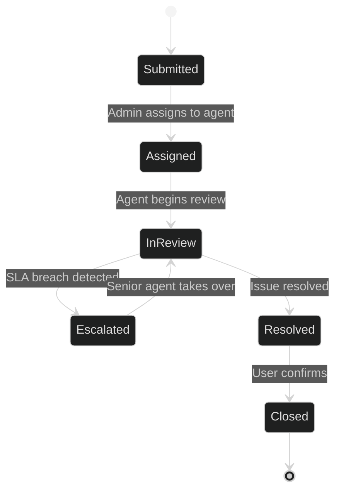
```mermaid
%%{init: {'theme': 'dark'}}%%
stateDiagram-v2
    [*] --> Submitted
    Submitted --> Assigned : Admin assigns to agent
    Assigned --> InReview : Agent begins review
    InReview --> Escalated : SLA breach detected
    InReview --> Resolved : Issue resolved
    Escalated --> InReview : Senior agent takes over
    Resolved --> Closed : User confirms
    Closed --> [*]
```

[](https://github.com/COZYkrish)

---

### 〔06〕 STUDY BEHAVIOR ANALYSIS

> *Data science meets education.*

An analytics-driven platform that tracks learning behavior, visualizes study patterns, and generates actionable insights to improve academic performance.

**✦ Core Features**
- Study session logging & time tracking
- Behavioral pattern recognition with ML
- Interactive visualizations (heatmaps, trend lines)
- Personalized performance insights
- Weekly/monthly analytics reports

**✦ Tech Stack:** `Python` `Pandas` `Plotly` `scikit-learn` `Flask` `React`

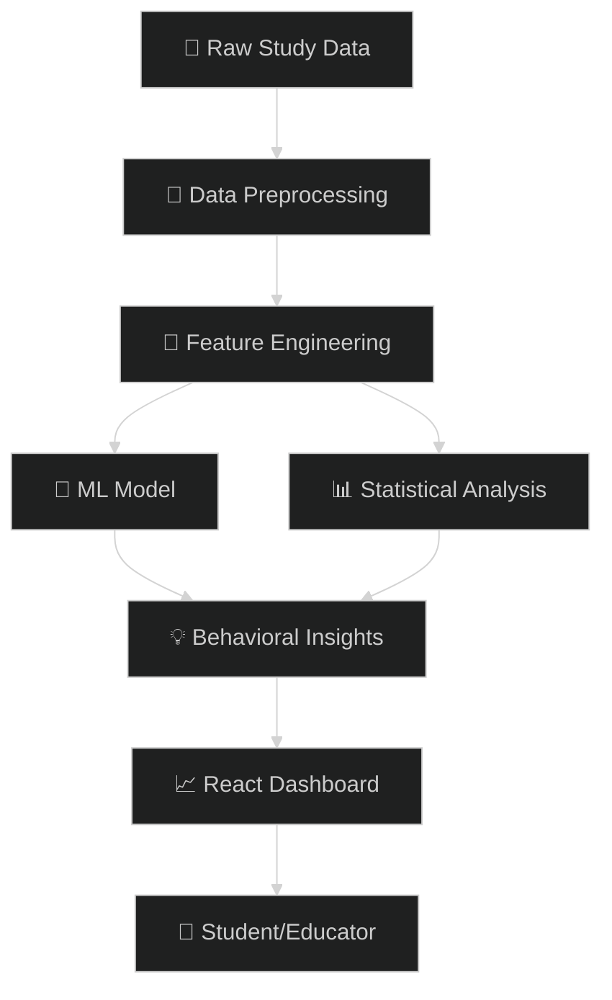
```mermaid
%%{init: {'theme': 'dark'}}%%
flowchart TD
    INPUT["📝 Raw Study Data"] --> CLEAN["🧹 Data Preprocessing"]
    CLEAN --> FEATURE["🔧 Feature Engineering"]
    FEATURE --> ML["🤖 ML Model"]
    FEATURE --> STATS["📊 Statistical Analysis"]
    ML --> INSIGHTS["💡 Behavioral Insights"]
    STATS --> INSIGHTS
    INSIGHTS --> DASH["📈 React Dashboard"]
    DASH --> USER["👤 Student/Educator"]
```

[](https://github.com/COZYkrish)

---

### 〔07〕 FITNESS ANALYZER

> *Your health, quantified.*

A comprehensive health analytics platform that tracks fitness activities, monitors progress over time, and delivers personalized insights through data visualization.

**✦ Core Features**
- Activity logging: workouts, steps, calories
- Progress trend visualization (Plotly/Recharts)
- Goal setting with milestone tracking
- BMI, calorie, and fitness score calculators
- Personalized recommendation engine

**✦ Tech Stack:** `React` `Python/FastAPI` `MySQL` `Recharts` `Pandas`


```mermaid
%%{init: {'theme': 'dark'}}%%
flowchart LR
    LOG["📋 Activity Log"] --> API["FastAPI Backend"]
    API --> DB["MySQL Storage"]
    DB --> ANALYTICS["📊 Analytics Engine"]
    ANALYTICS --> RECO["🤖 Recommendation Model"]
    RECO --> INSIGHTS["💡 Personalized Insights"]
    INSIGHTS --> DASH["📈 Dashboard UI"]
```

[](https://github.com/COZYkrish)

---

### 〔08〕 MODERN EXPENSE TRACKER

> *Financial clarity, beautifully visualized.*

A personal finance platform with budgeting workflows, expense categorization, analytics dashboards, and trend insights — built for real financial clarity.

**✦ Core Features**
- Expense CRUD with category tagging
- Budget vs. actual tracking with alerts
- Trend charts: monthly, weekly, categorical
- Income vs. expense balance engine
- Export reports (PDF/CSV)

**✦ Tech Stack:** `React` `Flask/FastAPI` `MySQL` `Recharts` `Tailwind`

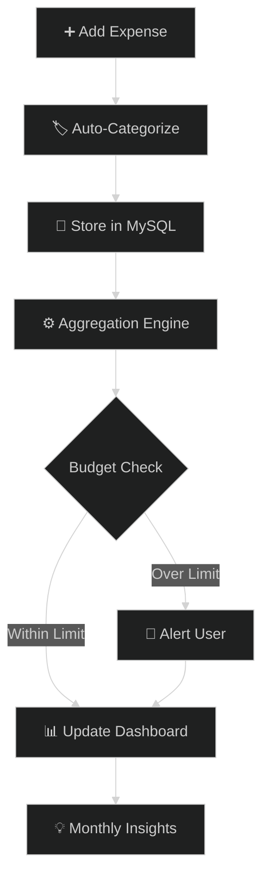
```mermaid
%%{init: {'theme': 'dark'}}%%
flowchart TD
    ADD["➕ Add Expense"] --> CATEGORIZE["🏷️ Auto-Categorize"]
    CATEGORIZE --> DB["💾 Store in MySQL"]
    DB --> AGGREGATE["⚙️ Aggregation Engine"]
    AGGREGATE --> BUDGET{"Budget Check"}
    BUDGET -- Over Limit --> ALERT["🚨 Alert User"]
    BUDGET -- Within Limit --> CHART["📊 Update Dashboard"]
    ALERT --> CHART
    CHART --> INSIGHTS["💡 Monthly Insights"]
```

[](https://github.com/COZYkrish)

---

### 〔09〕 ONLINE BANKING SYSTEM

> *Enterprise-grade banking simulation.*

A secure, full-featured banking simulation platform with JWT authentication, transaction processing, account management, and an enterprise-grade backend architecture.

**✦ Core Features**
- Multi-account management (savings, current)
- Secure fund transfers with balance validation
- Transaction history with filtering
- JWT + Role-based access control
- Admin oversight dashboard

**✦ Tech Stack:** `React` `Spring Boot` `MySQL` `JWT` `BCrypt`

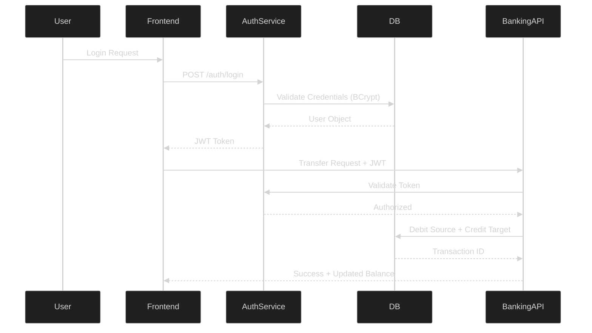
```mermaid
%%{init: {'theme': 'dark'}}%%
sequenceDiagram
    User->>Frontend: Login Request
    Frontend->>AuthService: POST /auth/login
    AuthService->>DB: Validate Credentials (BCrypt)
    DB-->>AuthService: User Object
    AuthService-->>Frontend: JWT Token
    Frontend->>BankingAPI: Transfer Request + JWT
    BankingAPI->>AuthService: Validate Token
    AuthService-->>BankingAPI: Authorized
    BankingAPI->>DB: Debit Source + Credit Target
    DB-->>BankingAPI: Transaction ID
    BankingAPI-->>Frontend: Success + Updated Balance
```

[](https://github.com/COZYkrish)

---

### 〔10〕 FINTECH DASHBOARD

> *The future of financial intelligence.*

A cinematic fintech analytics dashboard with real-time KPI tracking, transaction insights, portfolio analytics, and a futuristic glassmorphic UI — built to impress.

**✦ Core Features**
- Real-time KPI cards: revenue, growth, churn
- Transaction timeline with anomaly detection
- Portfolio allocation charts (donut, treemap)
- Predictive trend analysis
- Dark glassmorphic dashboard UI

**✦ Tech Stack:** `React` `Recharts/Plotly` `FastAPI` `Tailwind CSS` `Python`

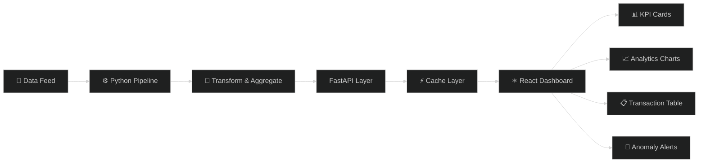
```mermaid
%%{init: {'theme': 'dark'}}%%
flowchart LR
    FEED["📡 Data Feed"] --> PIPELINE["⚙️ Python Pipeline"]
    PIPELINE --> TRANSFORM["🔄 Transform & Aggregate"]
    TRANSFORM --> API["FastAPI Layer"]
    API --> CACHE["⚡ Cache Layer"]
    CACHE --> REACT["⚛️ React Dashboard"]
    REACT --> KPI["📊 KPI Cards"]
    REACT --> CHARTS["📈 Analytics Charts"]
    REACT --> TABLE["📋 Transaction Table"]
    REACT --> ALERTS["🚨 Anomaly Alerts"]
```

[](https://github.com/COZYkrish)


---

## ◈ CLOUD ENGINEERING MATRIX

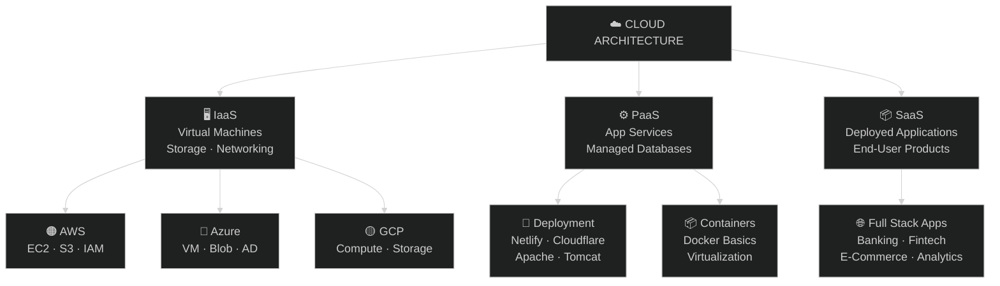
```mermaid
%%{init: {'theme': 'dark'}}%%
graph TB
    CLOUD["☁️ CLOUD ARCHITECTURE"] --> IaaS["🖥️ IaaS<br/>Virtual Machines<br/>Storage · Networking"]
    CLOUD --> PaaS["⚙️ PaaS<br/>App Services<br/>Managed Databases"]
    CLOUD --> SaaS["📦 SaaS<br/>Deployed Applications<br/>End-User Products"]

    IaaS --> AWS["🟠 AWS<br/>EC2 · S3 · IAM"]
    IaaS --> AZURE["🔵 Azure<br/>VM · Blob · AD"]
    IaaS --> GCP["🟡 GCP<br/>Compute · Storage"]

    PaaS --> DEPLOY["🚀 Deployment<br/>Netlify · Cloudflare<br/>Apache · Tomcat"]
    PaaS --> CONTAINER["📦 Containers<br/>Docker Basics<br/>Virtualization"]

    SaaS --> APPS["🌐 Full Stack Apps<br/>Banking · Fintech<br/>E-Commerce · Analytics"]
```

**Cloud Learning Roadmap:**

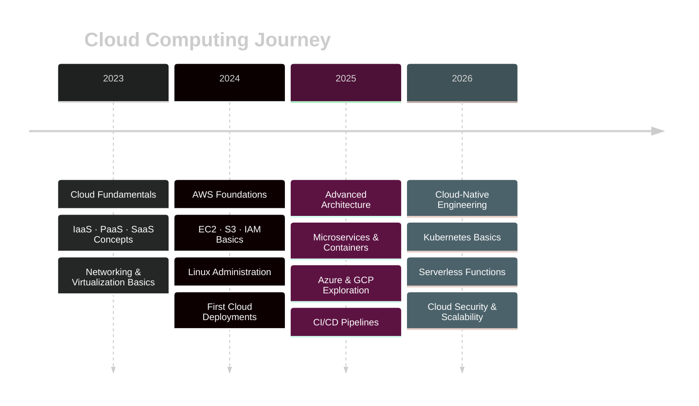
```mermaid
%%{init: {'theme': 'dark'}}%%
timeline
    title Cloud Computing Journey
    2023 : Cloud Fundamentals
         : IaaS · PaaS · SaaS Concepts
         : Networking & Virtualization Basics
    2024 : AWS Foundations
         : EC2 · S3 · IAM Basics
         : Linux Administration
         : First Cloud Deployments
    2025 : Advanced Architecture
         : Microservices & Containers
         : Azure & GCP Exploration
         : CI/CD Pipelines
    2026 : Cloud-Native Engineering
         : Kubernetes Basics
         : Serverless Functions
         : Cloud Security & Scalability
```

---

## ◈ ENGINEERING TIMELINE

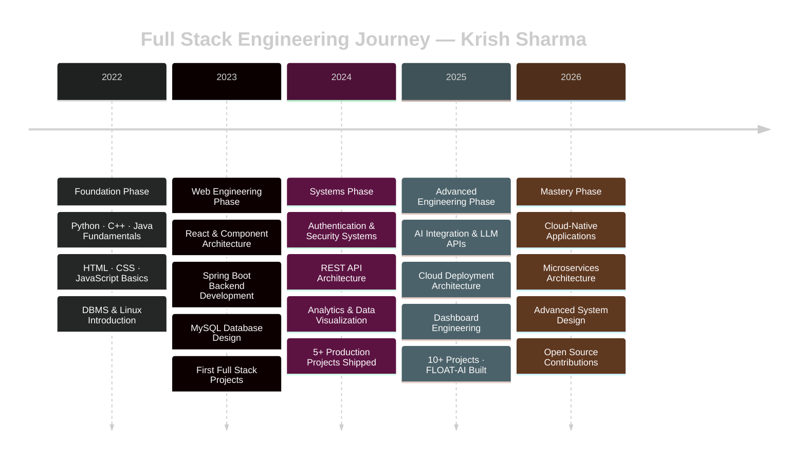
```mermaid
%%{init: {'theme': 'dark'}}%%
timeline
    title Full Stack Engineering Journey — Krish Sharma
    2022 : Foundation Phase
         : Python · C++ · Java Fundamentals
         : HTML · CSS · JavaScript Basics
         : DBMS & Linux Introduction
    2023 : Web Engineering Phase
         : React & Component Architecture
         : Spring Boot Backend Development
         : MySQL Database Design
         : First Full Stack Projects
    2024 : Systems Phase
         : Authentication & Security Systems
         : REST API Architecture
         : Analytics & Data Visualization
         : 5+ Production Projects Shipped
    2025 : Advanced Engineering Phase
         : AI Integration & LLM APIs
         : Cloud Deployment Architecture
         : Dashboard Engineering
         : 10+ Projects · FLOAT-AI Built
    2026 : Mastery Phase
         : Cloud-Native Applications
         : Microservices Architecture
         : Advanced System Design
         : Open Source Contributions
```

---

## ◈ GITHUB ANALYTICS COMMAND CENTER

<div align="center">


</div>

<div align="center">


</div>

<div align="center">

[](https://github.com/COZYkrish)

</div>

<div align="center">


</div>

<div align="center">

<!-- CONTRIBUTION SNAKE ANIMATION -->


</div>


---

## ◈ OPEN SOURCE & COLLABORATION

<div align="center">

```
╔════════════════════════════════════════════════════════════╗
║         OPEN TO COLLABORATING ON:                          ║
║                                                            ║
║   ⚡ Cloud-Native Web Applications                         ║
║   🤖 AI-Powered Full Stack Systems                         ║
║   📊 Analytics Dashboards & Data Platforms                 ║
║   🚀 DevOps & Cloud Deployment Projects                    ║
║   🎮 Interactive & Immersive UI Systems                    ║
╚════════════════════════════════════════════════════════════╝
```

</div>

**My Engineering Philosophy:**

> *Build systems that are not just functional today — but architected for tomorrow.*

I believe in:
- **Open collaboration** — great systems are built by great teams
- **Continuous learning** — the best engineers never stop being students  
- **Engineering with intent** — every line of code should have a purpose
- **Design that inspires** — interfaces should feel like experiences
- **Scalability by default** — build for 10 users, architect for 10 million

---

## ◈ TRANSMISSION CHANNELS

<div align="center">

[](https://github.com/COZYkrish)
[](https://linkedin.com/in/krish-sharma-710927380)
[](https://instagram.com/wtf.kid_ish)
[](mailto:cozykrish2916@gmail.com)

</div>


---

<div align="center">


```
╔══════════════════════════════════════════════════════════════════════╗
║                                                                      ║
║   "The code you write today is the infrastructure of tomorrow."      ║
║                                         — COZYkrish                  ║
║                                                                      ║
╚══════════════════════════════════════════════════════════════════════╝
```


</div>

<!-- SETUP NOTE: To enable the contribution snake animation, add this GitHub Action:
File: .github/workflows/snake.yml

name: Generate Snake Animation
on:
  schedule: [{ cron: "0 */12 * * *" }]
  workflow_dispatch:
jobs:
  generate:
    runs-on: ubuntu-latest
    steps:
      - uses: Platane/snk@v3
        with:
          github_user_token: ${{ secrets.GITHUB_TOKEN }}
          outputs: |
            dist/github-contribution-grid-snake.svg
            dist/github-contribution-grid-snake-dark.svg?palette=github-dark
      - uses: crazy-max/ghaction-github-pages@v3
        with:
          target_branch: output
          build_dir: dist
        env:
          GITHUB_TOKEN: ${{ secrets.GITHUB_TOKEN }}
-->
