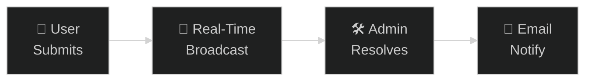
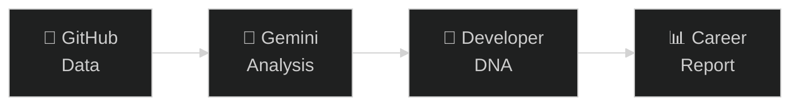
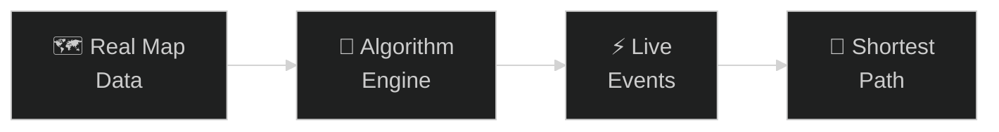
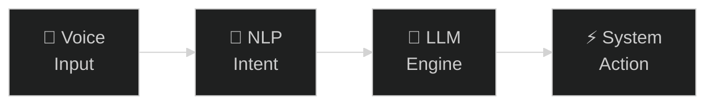
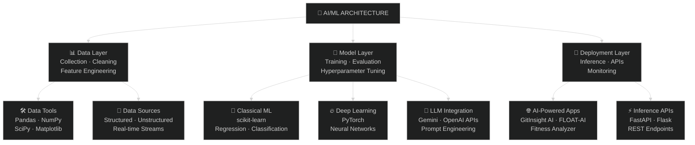
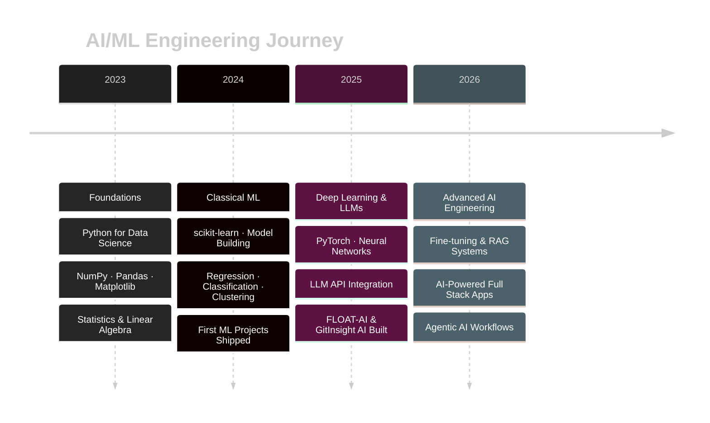
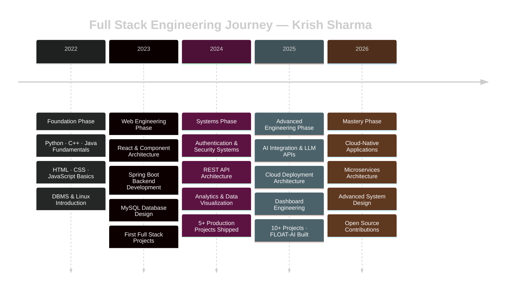

<div align="center">

<!-- ANIMATED TYPING HERO -->


</div>

<div align="center">

[](https://git.io/typing-svg)

</div>

<div align="center">


[](https://github.com/COZYkrish)
[](https://github.com/COZYkrish)

</div>

<div align="center">

```
╔══════════════════════════════════════════════════════════════════╗
║  "The future belongs to those who engineer it — line by line."   ║
╚══════════════════════════════════════════════════════════════════╝
```

</div>


---

## ◈ SYSTEM IDENTITY

<table>
<tr>
<td width="55%">

### 👾 `> INIT_PROFILE.exe`

```yaml
name: "Krish Sharma"
alias: "COZYkrish"
role: "Full Stack Engineer & Cloud Architect"
university: "Centurion University of Technology"
degree: "Bachelor of Computer Applications"
location: "India 🇮🇳"
status: "Building the future, one commit at a time"

focus_areas:
  - "Full Stack Web Engineering"
  - "Cloud Computing & Architecture"
  - "AI-Powered Applications"
  - "Dashboard & Analytics Systems"
  - "Immersive UI/UX Systems"

currently_learning:
  - "AWS / Azure / GCP Architecture"
  - "Microservices & Containers"
  - "LLM Integration Patterns"
  - "Advanced System Design"
```

</td>
<td width="45%" align="center">


<br>


</td>
</tr>
</table>

---

## ◈ ORIGIN STORY

<div align="center">

> *"I didn't start with a computer science degree — I started with curiosity."*

</div>

It began with a simple question: *"How does a website actually work?"*

That question opened a rabbit hole that never closed. From writing my first `Hello World` in Python to designing multi-layered full-stack systems with real-time analytics, authentication flows, and cloud deployment pipelines — every line of code has been a step deeper into an obsession.

As a **BCA student at Centurion University**, I've been on a mission to go beyond the curriculum. While others study theory, I build systems. I've shipped **10+ full-stack projects** spanning fintech dashboards, AI desktop assistants, enterprise complaint platforms, and fitness analytics engines — each one a piece of a larger engineering identity.

My passion lives at the intersection of **engineering depth** and **design beauty** — where scalable backend architecture meets immersive, futuristic user interfaces. I believe software should not just *work* — it should feel *alive*.

Currently, I'm going deep on **cloud computing** and **AI integration**, learning how to architect systems that aren't just functional today, but scalable for what comes next.

**I don't just write code. I engineer experiences.**


---

## ◈ TECH ARSENAL

### 🎨 Frontend Engineering


### ⚙️ Backend Engineering


### 🗄️ Databases & Storage


### ☁️ Cloud & Infrastructure


### 🤖 AI / ML & Data Analytics


### 🛠️ Tools & DevOps


---

## ◈ CURRENTLY BUILDING

<table>
<tr>
<td width="55%" valign="top">

### 👾 `> status --live`

```yaml
status: "🟢 Available for collaboration"
currently_building: "AI/ML powered systems"
currently_learning:
  - "Kubernetes & container orchestration"
  - "Serverless architecture patterns"
  - "Advanced LLM integration"

active_focus: "AI Integration · Cloud Engineering"
mode: "Shipping > Perfecting"
coffee_level: "████████░░ 80%"

currently_solving: "DSA — sharpening problem-solving daily"
next_up: "TBD — always cooking something"
```

> *"Currently deep in the terminal, probably debugging something at 2 AM."*

</td>
<td width="45%" align="center">


</td>
</tr>
</table>


---

## ◈ FEATURED PROJECTS

<div align="center">

<table>
<tr>
<td width="50%" valign="top">

### 🎯 SMART-COMPLAINT-SERVICE-PLATFORM
**Smart Complaint Service Platform** — Premium SaaS complaint management platform

Production-grade complaint management system with real-time Socket.io updates, 3D WebGL hero animations, JWT auth, email notifications, and admin analytics dashboard.

**Stack:** `React` `Node.js` `Express` `MongoDB` `Socket.io`

[](https://github.com/COZYkrish/Smart-Complaint-Service-Platform)



```mermaid
%%{init: {'theme': 'dark'}}%%
flowchart LR
    USER["👤 User\nSubmits"] --> RT["📡 Real-Time\nBroadcast"]
    RT --> ADMIN["🛠️ Admin\nResolves"]
    ADMIN --> NOTIFY["📧 Email\nNotify"]
```

</td>
<td width="50%" valign="top">

### 🧬 GITINSIGHT-AI
**GitInsight AI** — Transform Your GitHub Into Career Intelligence

AI-powered developer intelligence platform that analyzes GitHub profiles to generate Developer DNA™, portfolio scores, AI recruiter simulations, and auto-generated resumes.

**Stack:** `React` `TypeScript` `Node.js` `MongoDB` `Gemini AI`

[](https://github.com/COZYkrish/GITINSIGHT-AI)



```mermaid
%%{init: {'theme': 'dark'}}%%
flowchart LR
    GH["🐙 GitHub\nData"] --> AI["🤖 Gemini\nAnalysis"]
    AI --> DNA["🧬 Developer\nDNA"]
    DNA --> REPORT["📊 Career\nReport"]
```

</td>
</tr>
<tr>
<td width="50%" valign="top">

### 🗺️ ROUTEWISE-LAB
**Routewise Lab** — Real-World Graph Algorithm Visualization Platform

Interactive platform visualizing Dijkstra, A*, Greedy BFS, and Bidirectional search algorithms operating live on real OpenStreetMap road network data.

**Stack:** `React` `TypeScript` `Leaflet` `Zustand` `Vite`

[](https://github.com/COZYkrish/ROUTEWISE-LAB-Flagship-Real-World-Graph-Algorithm-Visualization-Platform)



```mermaid
%%{init: {'theme': 'dark'}}%%
flowchart LR
    MAP["🗺️ Real Map\nData"] --> ALGO["🧠 Algorithm\nEngine"]
    ALGO --> EVENT["⚡ Live\nEvents"]
    EVENT --> PATH["🏁 Shortest\nPath"]
```

</td>
<td width="50%" valign="top">

### 🤖 FLOAT-AI — Voice of Your Desktop
**Float above the busy work.** AI-powered desktop assistant with voice control, NLP intent routing, and hands-free system interaction.

*"Listen. Understand. Act."*

**Stack:** `Python` `LLM APIs` `Speech Recognition` `FastAPI`

[](https://github.com/COZYkrish/FLOAT-AI_The-voice-of-your-desktop.)



```mermaid
%%{init: {'theme': 'dark'}}%%
flowchart LR
    VOICE["🎤 Voice\nInput"] --> NLP["🧠 NLP\nIntent"]
    NLP --> AI["🤖 LLM\nEngine"]
    AI --> ACTION["⚡ System\nAction"]
```

</td>
</tr>
</table>

</div>

---

## ◈ AI/ML ENGINEERING MATRIX


```mermaid
%%{init: {'theme': 'dark'}}%%
graph TB
    AI["🤖 AI/ML ARCHITECTURE"] --> DATA["📊 Data Layer<br/>Collection · Cleaning<br/>Feature Engineering"]
    AI --> MODEL["🧠 Model Layer<br/>Training · Evaluation<br/>Hyperparameter Tuning"]
    AI --> DEPLOY["🚀 Deployment Layer<br/>Inference · APIs<br/>Monitoring"]

    DATA --> TOOLS["🛠️ Data Tools<br/>Pandas · NumPy<br/>SciPy · Matplotlib"]
    DATA --> SOURCES["📁 Data Sources<br/>Structured · Unstructured<br/>Real-time Streams"]

    MODEL --> CLASSICAL["📐 Classical ML<br/>scikit-learn<br/>Regression · Classification"]
    MODEL --> DEEP["🔥 Deep Learning<br/>PyTorch<br/>Neural Networks"]
    MODEL --> LLM["💬 LLM Integration<br/>Gemini · OpenAI APIs<br/>Prompt Engineering"]

    DEPLOY --> APPS["🌐 AI-Powered Apps<br/>GitInsight AI · FLOAT-AI<br/>Fitness Analyzer"]
    DEPLOY --> API["⚡ Inference APIs<br/>FastAPI · Flask<br/>REST Endpoints"]
```

**AI/ML Learning Roadmap:**


```mermaid
%%{init: {'theme': 'dark'}}%%
timeline
    title AI/ML Engineering Journey
    2023 : Foundations
         : Python for Data Science
         : NumPy · Pandas · Matplotlib
         : Statistics & Linear Algebra
    2024 : Classical ML
         : scikit-learn · Model Building
         : Regression · Classification · Clustering
         : First ML Projects Shipped
    2025 : Deep Learning & LLMs
         : PyTorch · Neural Networks
         : LLM API Integration
         : FLOAT-AI & GitInsight AI Built
    2026 : Advanced AI Engineering
         : Fine-tuning & RAG Systems
         : AI-Powered Full Stack Apps
         : Agentic AI Workflows
```

---

## ◈ ENGINEERING TIMELINE


```mermaid
%%{init: {'theme': 'dark'}}%%
timeline
    title Full Stack Engineering Journey — Krish Sharma
    2022 : Foundation Phase
         : Python · C++ · Java Fundamentals
         : HTML · CSS · JavaScript Basics
         : DBMS & Linux Introduction
    2023 : Web Engineering Phase
         : React & Component Architecture
         : Spring Boot Backend Development
         : MySQL Database Design
         : First Full Stack Projects
    2024 : Systems Phase
         : Authentication & Security Systems
         : REST API Architecture
         : Analytics & Data Visualization
         : 5+ Production Projects Shipped
    2025 : Advanced Engineering Phase
         : AI Integration & LLM APIs
         : Cloud Deployment Architecture
         : Dashboard Engineering
         : 10+ Projects · FLOAT-AI Built
    2026 : Mastery Phase
         : Cloud-Native Applications
         : Microservices Architecture
         : Advanced System Design
         : Open Source Contributions
```

---

## ◈ GITHUB ANALYTICS COMMAND CENTER

<div align="center">


</div>

<div align="center">


</div>

<div align="center">


</div>

<div align="center">


</div>

<div align="center">

<!-- CONTRIBUTION SNAKE ANIMATION -->

</div>


---

## ◈ OPEN SOURCE & COLLABORATION

<div align="center">

```
╔════════════════════════════════════════════════════════════╗
║         OPEN TO COLLABORATING ON:                          ║
║                                                            ║
║   ⚡ Cloud-Native Web Applications                         ║
║   🤖 AI-Powered Full Stack Systems                         ║
║   📊 Analytics Dashboards & Data Platforms                 ║
║   🚀 DevOps & Cloud Deployment Projects                    ║
║   🎮 Interactive & Immersive UI Systems                    ║
╚════════════════════════════════════════════════════════════╝
```

</div>

**My Engineering Philosophy:**

> *Build systems that are not just functional today — but architected for tomorrow.*

I believe in:
- **Open collaboration** — great systems are built by great teams
- **Continuous learning** — the best engineers never stop being students  
- **Engineering with intent** — every line of code should have a purpose
- **Design that inspires** — interfaces should feel like experiences
- **Scalability by default** — build for 10 users, architect for 10 million

---

## ◈ TRANSMISSION CHANNELS

<div align="center">

[](https://github.com/COZYkrish)
[](https://linkedin.com/in/krish-sharma-710927380)
[](https://instagram.com/wtf.kid_ish)
[](mailto:cozykrish2916@gmail.com)

</div>


---

<div align="center">


<br>


</div>

<!-- SETUP NOTE: To enable the contribution snake animation, add this GitHub Action:
File: .github/workflows/snake.yml

name: Generate Snake Animation
on:
  schedule: [{ cron: "0 */12 * * *" }]
  workflow_dispatch:
jobs:
  generate:
    runs-on: ubuntu-latest
    steps:
      - uses: Platane/snk@v3
        with:
          github_user_token: ${{ secrets.GITHUB_TOKEN }}
          outputs: |
            dist/github-contribution-grid-snake.svg
            dist/github-contribution-grid-snake-dark.svg?palette=github-dark
      - uses: crazy-max/ghaction-github-pages@v3
        with:
          target_branch: output
          build_dir: dist
        env:
          GITHUB_TOKEN: ${{ secrets.GITHUB_TOKEN }}
-->
